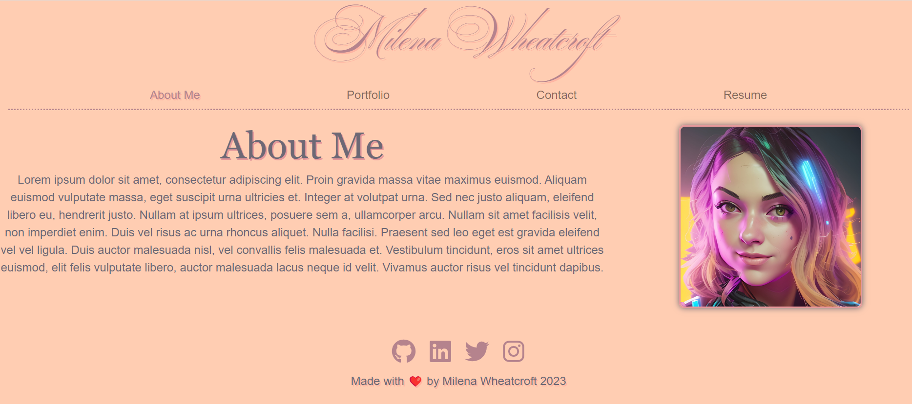

# React Portfolio

## Description

[Deployed Application](https://comforting-daifuku-2d1168.netlify.app/)
This is a portfolio built using React. It is a single page application that uses React Router to navigate between pages. It uses React Bootstrap for styling and responsiveness. It also uses React Icons for the icons in the navbar. The contact form at the moment does not send an email since we do not have a back-end, but it does validate the input and display an error message if the input is invalid.  
The portfolio is deployed on Netlify. It showcases some of my projects and has a link to my downloadable resume. The navbar is responsive and collapses on smaller screens. The portfolio is also responsive and looks good on mobile devices.  
I learned a lot about React while building this portfolio. I learned about React Router, React Bootstrap, and React Icons. I also learned about how to use React to create a single page application. I struggled a little with some css styling, but I was able to figure it out. I look forward to learning more about React and using it to build more applications.

## Table of Contents

- [Installation](#Installation)
- [Usage](#Usage)
- [Credits](#Credits)
- [License](#License)
- [Contributing](#Contributing)
- [Tests](#Tests)
- [Questions](#Questions)

## Installation
There is no installation required to use the portfolio. If you want to run it locally, you will need to clone the [repo](https://github.com/milena-allaway/react_portfolio) and run `npm install` in the root directory. You will also need to run `npm install` in the client directory. You can then run `npm start` in the root directory to start the server and view the portfolio in your browser.

## Usage

The portfolio can be accessed [by clicking here](https://comforting-daifuku-2d1168.netlify.app/)
You can also run it locally by cloning the repo and running `npm start` in the root directory.
Browse the site by clicking on the links in the navbar. You can view some information about me, my projects, and contact me. You can also view my resume and download it if needed. Here is a screenshot of the portfolio home page:

## Credits

* https://reactrouter.com/en/main/start/tutorial
* https://react-bootstrap.netlify.app/docs/components/navbar#overview
* https://react-bootstrap.netlify.app/docs/forms/overview
* https://react-bootstrap.netlify.app/docs/forms/form-control
* https://react-bootstrap.netlify.app/docs/components/overlays
* https://react-icons.github.io/react-icons/
* https://www.npmjs.com/package/react-icons
* https://www.linkedin.com/pulse/what-relnoopener-noreferrer-madhu-sudanan/
* https://legacy.reactjs.org/docs/events.html#focus-events
* https://legacy.reactjs.org/docs/events.html#onblur
* https://react.dev/reference/react-dom/components/common#common-props
* https://chat.openai.com/

## License

This project is covered under the MIT License. For more information [click here](https://opensource.org/license/mit/).

## Contributing

Create an issue in GitHub [repo](https://github.com/milena-allaway/react_portfolio/issues)

## Tests

N/A. No tests are included in this app.

## Questions

For any questions or feedback, please contact me via:
- GitHub: [milena-allaway](https://github.com/milena-allaway)
- Email: [milenawheatcroft@gmail.com](mailto:milenawheatcroft@gmail.com)

***

Made with ❤️ by Milena Allaway 2023
